# CircleERP

ERP de demonstração com back-end em .NET e front-end em React, construído sobre
**DDD + Clean Architecture**. O objetivo não é cobrir todo o escopo de um ERP
comercial, e sim mostrar as regras de negócio vivendo no domínio — testáveis sem
banco, sem HTTP e sem framework.

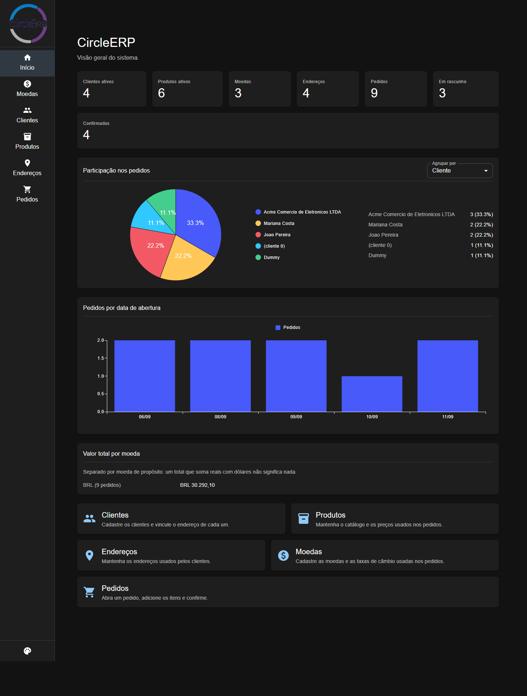

---

## Módulos

| Módulo | O que faz |
|---|---|
| **Clientes** | Pessoa física ou jurídica, com CPF/CNPJ validado de verdade e endereço vinculado |
| **Endereços** | Cadastro próprio, com preenchimento automático pelo CEP |
| **Produtos** | Catálogo com SKU, unidade de medida e preço de venda |
| **Moedas** | Código ISO 4217, símbolo e taxa de câmbio |
| **Pedidos** | Rascunho → confirmado, com itens, totais e cancelamento |
| **Painel** | Participação nos pedidos por cliente, situação ou moeda, e volume por data |

---

## Telas

### Pedidos

Lista com situação, total e data. O total de cada pedido é calculado a partir das
linhas — nunca uma coluna gravada.

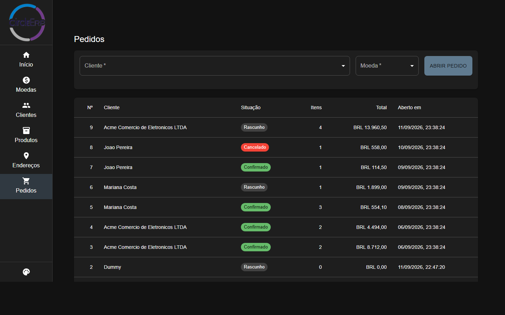

### Detalhe do pedido

Enquanto está em rascunho, o pedido aceita itens. Cada linha guarda o produto, a
quantidade e **o preço praticado na venda**: reajustar o produto depois não
reescreve o pedido.

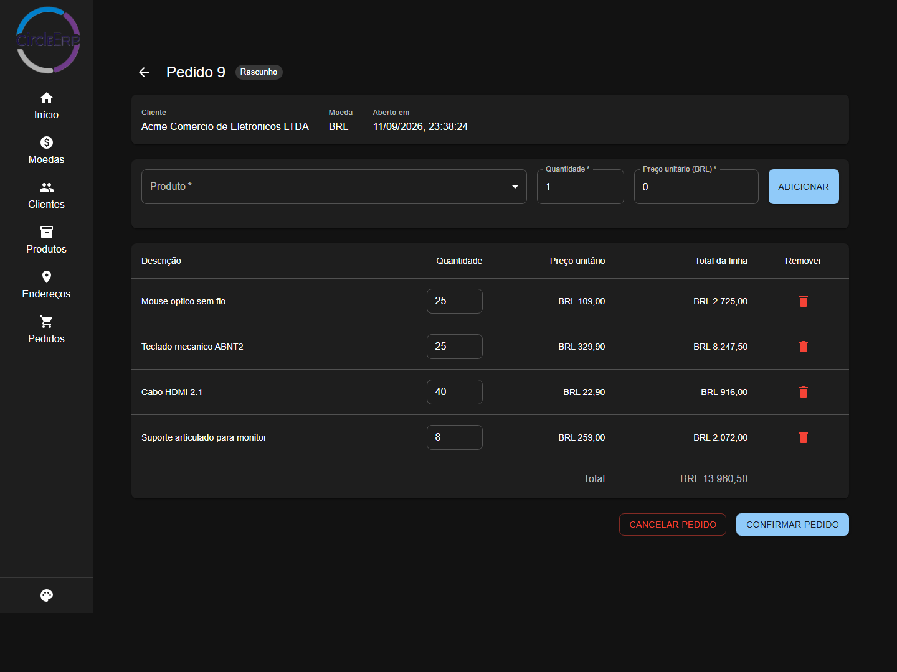

### Clientes

O documento é validado pelos dígitos verificadores e gravado só com números, para
que `529.982.247-25` e `52998224725` não virem dois clientes. O tipo acompanha o
documento: não há como marcar pessoa jurídica portando um CPF.

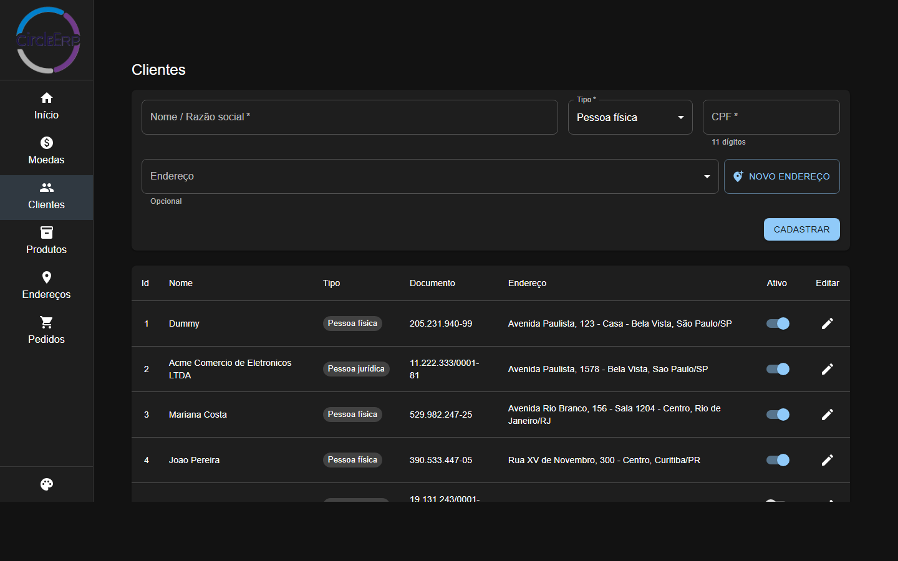

Endereço novo pode ser cadastrado sem sair da tela, e já entra vinculado:

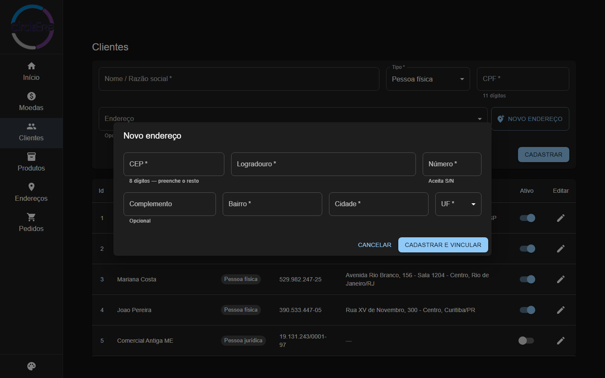

### Produtos

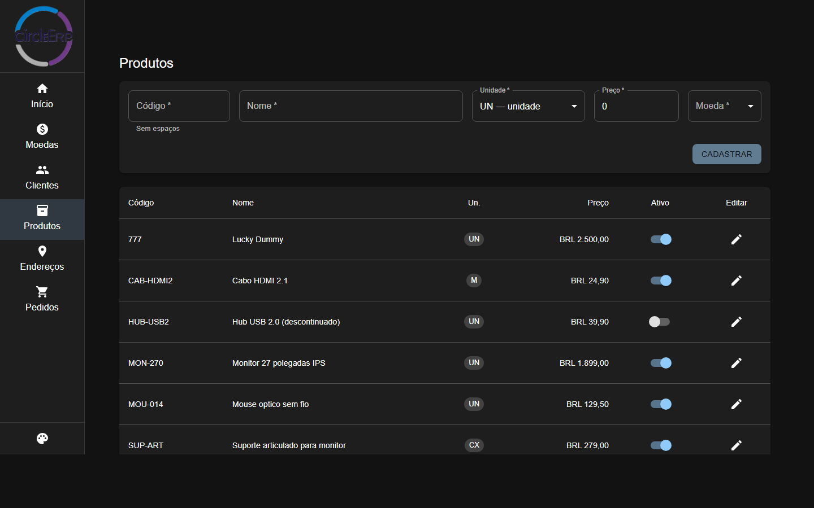

### Moedas

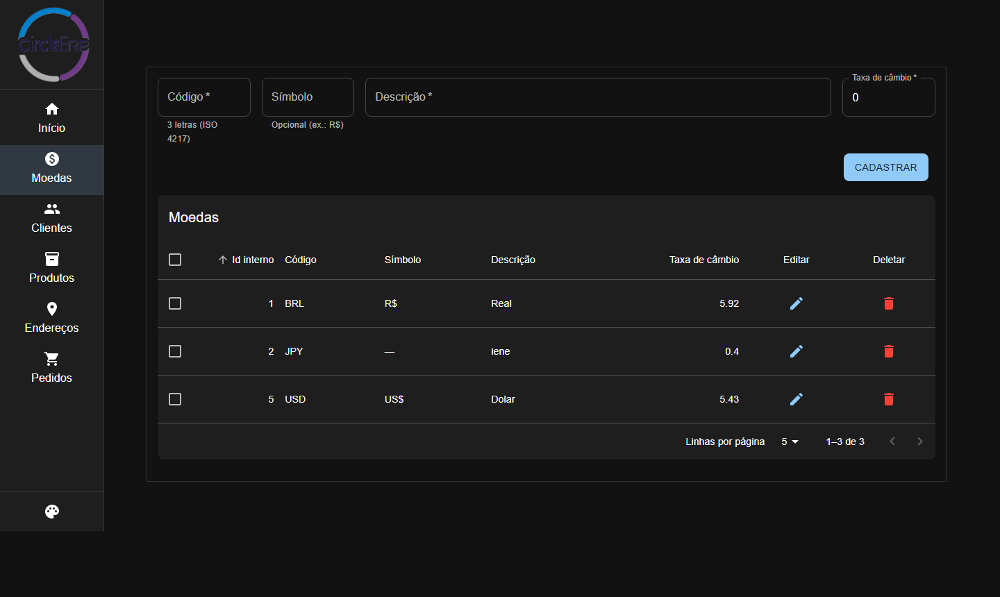

### Endereços

Digitar os 8 dígitos do CEP preenche logradouro, bairro, cidade e UF. Se o
serviço de consulta estiver fora, a tela avisa e o preenchimento manual continua.

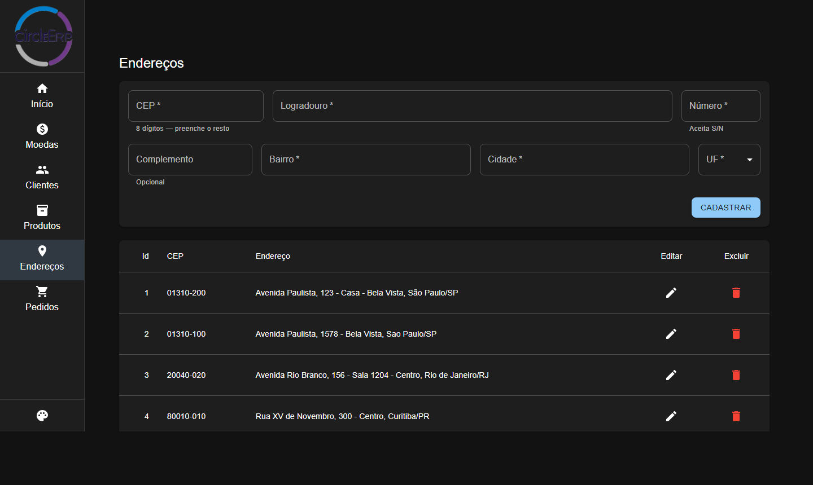

### Temas

Seis temas, incluindo a opção de acompanhar o claro/escuro do sistema
operacional. A escolha fica no navegador de quem usa.

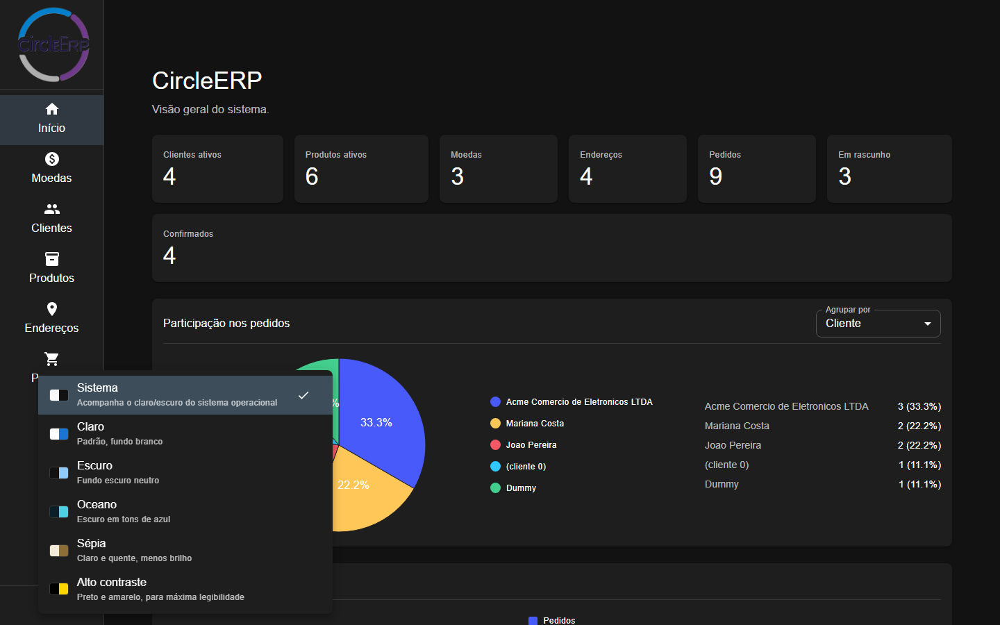

| Claro | Sépia | Oceano |
|---|---|---|
| 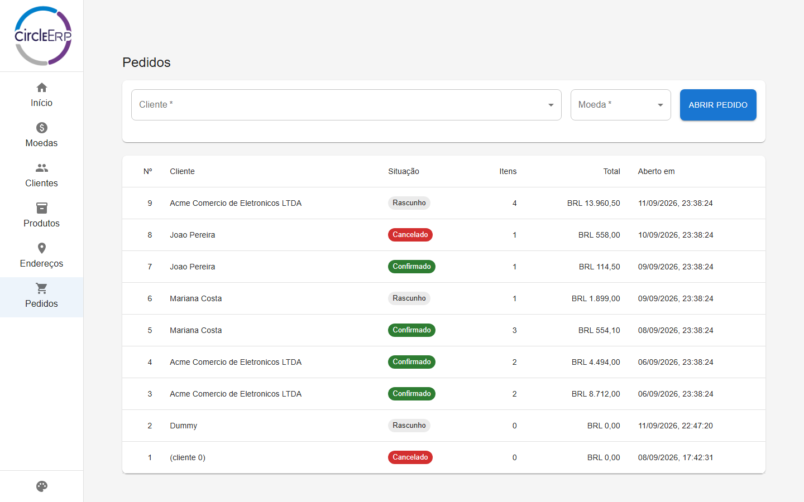 | 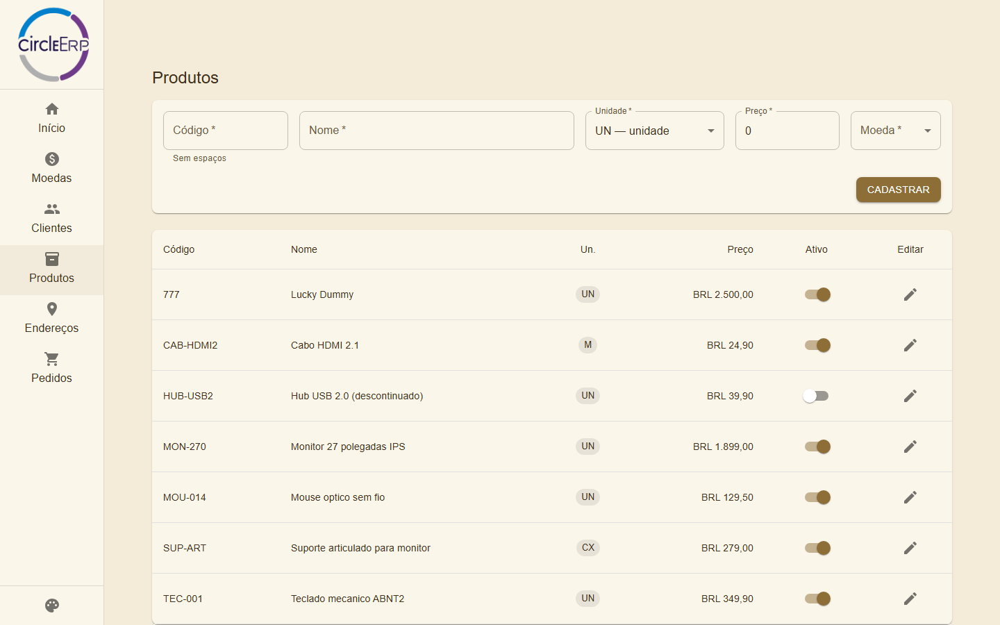 | 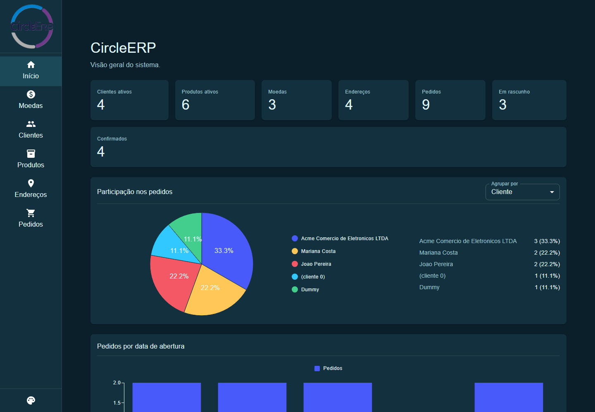 |

---

## Arquitetura

```
CircleERP.Domain          agregados, value objects, eventos — zero dependências
CircleERP.Application     casos de uso (MediatR), contratos de porta
CircleERP.Infrastructure  EF Core, MySQL, repositórios, integrações
CircleERP                 host da API: controllers, DI, middleware
```

As setas de dependência só apontam para dentro, e isso é garantido pelos
`ProjectReference` de cada `.csproj` — não existe caminho de compilação que
permita ao domínio enxergar EF Core.

Três decisões que atravessam o projeto inteiro:

**Objeto inválido não chega a existir.** A validação vive no construtor do value
object, não em `if`s espalhados por services. `CurrencyCode` com quatro letras,
CPF com dígito errado, quantidade zero ou preço negativo são recusados na
construção.

**Agregados se referenciam por identidade.** O pedido guarda o *id* do cliente e
o *código* da moeda, nunca os objetos. Se carregasse a moeda inteira, um pedido
antigo passaria a valer pela taxa de hoje.

**O que foi vendido é fato histórico.** A linha do pedido copia o nome e o preço
do produto no momento da venda. Reajustar o catálogo não mexe em pedido nenhum.

Detalhes em **[ARCHITECTURE.md](ARCHITECTURE.md)**.

---

## Tecnologias

| Camada | Stack |
|---|---|
| Back-end | C#, .NET 10, ASP.NET Core, MediatR, FluentResults |
| Persistência | EF Core 9, Pomelo, MySQL 5.7 |
| Front-end | React 18, TypeScript, Vite, MUI 6, MUI X Charts |
| Testes | NUnit — 221 testes (127 de domínio, 94 de integração) |
| CI | GitHub Actions |

Os testes de integração sobem a API em memória com `WebApplicationFactory` e
trocam o MySQL por SQLite, um banco por teste. Não dependem de servidor externo
nem de Docker:

```bash
dotnet test CircleERP.sln
```

---

## Como rodar

Requisitos: **.NET 10 SDK**, **Node 22** e um **MySQL** acessível.

**1.** Configure a string de conexão (a variável de ambiente `MYSQL_CONNECTION_STRING`
tem prioridade sobre esta):

```bash
dotnet user-secrets set "ConnectionStrings:CircleERP" "<sua-string>" --project CircleERP
```

**2.** Prepare o banco. O mesmo comando serve para banco novo e para um que já
exista — ver [docs/database-baseline.md](docs/database-baseline.md):

```bash
dotnet tool restore && dotnet ef database update --project CircleERP.Infrastructure --startup-project CircleERP.Infrastructure
```

**3.** Suba a API em https://localhost:5001, com a documentação em `/scalar`:

```bash
dotnet run --project CircleERP
```

**4.** Suba o front em http://localhost:54783:

```bash
npm install --prefix CircleERP.client && npm run dev --prefix CircleERP.client
```

---

## API

| Recurso | Rotas |
|---|---|
| Moedas | `GET/POST /api/currencies`, `GET/PUT/DELETE /api/currencies/{id}` |
| Endereços | `GET/POST /api/addresses`, `GET/PUT/DELETE /api/addresses/{id}`, `GET /api/addresses/lookup/{cep}` |
| Clientes | `GET/POST /api/customers`, `GET/PUT /api/customers/{id}`, `POST /api/customers/{id}/activate` e `/deactivate` |
| Produtos | `GET/POST /api/products`, `GET/PUT /api/products/{id}`, `POST /api/products/{id}/activate` e `/deactivate` |
| Pedidos | `GET/POST /api/orders`, `GET /api/orders/{id}`, itens em `/api/orders/{id}/items`, `POST /api/orders/{id}/place` e `/cancel` |
| Painel | `GET /api/orders/dashboard` |

Clientes e produtos **não têm DELETE**: registro com histórico se inativa, não se
apaga. Confirmar e cancelar um pedido são sub-recursos, e não um `PATCH` em
`status`, para que nenhuma requisição consiga pular etapa do ciclo.

Erros seguem `ProblemDetails` (RFC 7807): **400** para invariante violada, **404**
para recurso ausente, **409** para conflito com o estado atual e **503** quando um
serviço externo não responde.

---

## Observação sobre os dados das telas

As capturas acima usam dados fictícios criados para a demonstração. Os CPFs e
CNPJs são sintéticos — válidos pelo cálculo dos dígitos verificadores, porque o
domínio recusaria qualquer outro, mas não correspondem a pessoas reais.
